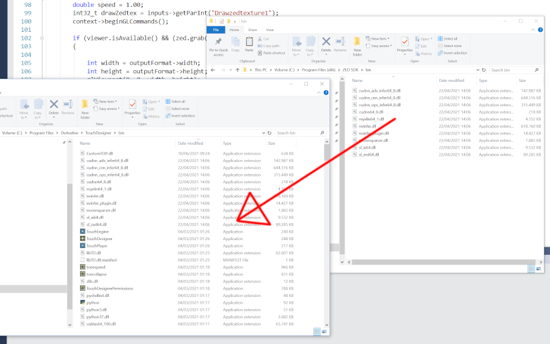
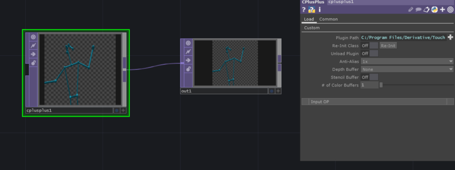

 # Fork from the official ZED examples
 
 This repository contains, among the ZED official examples, a TouchDesigner TOP operator for skeleton traking for the ZED 2 Camera. The template for the TOP operator comes from [TouchDesigner Plugin Template](https://github.com/satoruhiga/TouchDesigner-Plugin-Template)

 ## Installation

 ### Preparation
 
 Install the Zed SDK, I have tested it with 3.3.5. https://www.stereolabs.com/developers/release/

 Clone this repository and follow these [instructions](https://www.stereolabs.com/docs/app-development/cpp/windows/#building-on-windows) to build the examples.

Now in the build folder, you should have all the Zed Official examples ready to run. Open Visual Studio, open the ALL_BUILD solution. Among all the examples, select "body tracking" and set it as starting project. Run the solution, if a window opens, and the application is able to detect the a skeleton, your ZED SDK is installed correctly and you can proceed further.

### Custom TOP Operator 

 If the previous step works, open Visual Studio -> File -> Open -> Cmake and open the file "ZedTop/CMakeList.txt". Press Cmake -> Build all.

 Copy the file 'zedTop/cpp/out/CustomTOP.dll' inside your TouchDesigner bin folder(usually C:/Program Files/Derivative/TouchDesigner/bin/).

 Now copy to the same folder, all the files that are in "C:\Program Files (x86)\ZED SDK\bin\"
 
 

 Open TouchDesigner, create a new CplusPlus TOP and as dll give the path 'C:/Program Files/Derivative/TouchDesigner/bin/CustomTOP.dll'

 You should be able to perform skeleton traking
 
 

